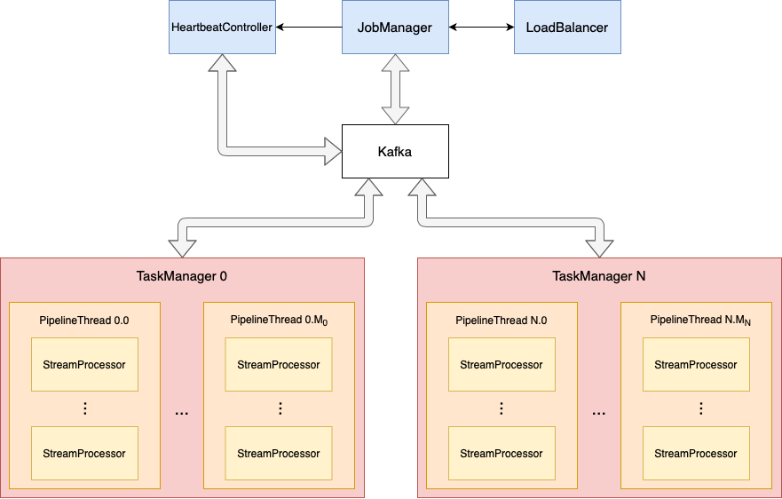
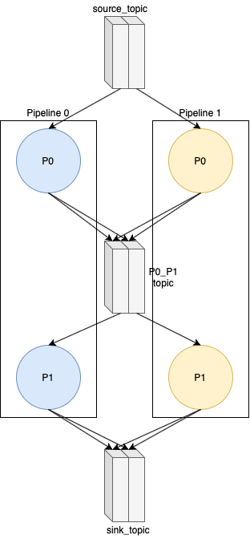

<p align="center">
  
</p>

# Apache Kafka Data Processing Pipeline 
## Assignment
- Provide administrative tools / scripts to create and deploy a processing pipeline that processes
messages from a given topic.
- A processing pipeline consists of multiple stages, each of them processing an input message
at a time and producing one output message for the downstream stage.
- Different processing stages could run on different processes for scalability.
- Messages have a key, and the processing of messages with different keys is independent.
- Messages having the same key are processed in FIFO order with end-to-end exactly once
delivery semantics. 

## Team Members
- [Mattia Righetti](https://github.com/MattRighetti)
- [Nicolò Felicioni](https://github.com/ciamir51)
- [Luca Conterio](https://github.com/luca-conterio)

## Architecture
The main components are:
  - `JobManager`: it acts as a sort of orchestrator, assigning processors to task managers. It also has a thread called `HeartbeatController` which receives heartbeats from task managers and notifies the job manager whenever one of them crashes. The `LoadBalancer` is used to assign processors to task managers by considering also the number of their available threads and to re-assign processors in the case that some task manager becomes inactive.
  - `TaskManager`: each task manager runs in a different process and possibily on a different machine. They have a set of available `PipelineThread` obejcts and a set of assigned processors.
  - `PipelineThread`: each pipeline thread receives from its parent task manager a set of processors to be executed. Periodically the thread loops over the processors list and executes them.
  - `StreamProcessor`: they are the actual processors of the pipeline. When executed they consume messages from incoming topics, perform some operation (according to their type), save their state (if stateful) and produce the results on the outgoing topics.
  - `Kafka Broker`: it manages the topics that are used for each type of communication among components.
  
<p align="center">
  
</p>

## Pipeline
In order to describe the structure of the processing pipeline a metalanguage based on `YAML` has to be used.  
The pipeline structure can be defined in `pipeline.yaml` file.  
  
The `pipeline.yaml` file is a list of processors objects that contains the following fields:
  - `id`: the processor's identifier.
  - `type`: the type of the processor, that can be `forward`, `sum`, `count`.
  - `to`: the list of processors the current one is connected to (i.e. each processor will send results to the processors contained in this list).
  
The processor that has no incoming arc, will directly be connected to the pipeline source.  
The `sink` keyword is used to indentify the last processor of the pipeline.  
  
Another configuration file is the `config.yaml` which defines some configuration variables for the system, such as the broker's IP address and port, the number of task managers to be used and the processors parallelism. In particular this last value indicates the number of replicas the pipeline has (i.e. if parallelism is equal to `n`, then each processor is replicated `n` times).  
In `config.yaml` it is also possible to change the name of the topics that are used as input and output for the pipeline (namely, `source_topic` and `sink_topic`).

### Topics
Kafka topics are used to model the arcs of the pipeline graph. In particular the name of each topic is composed by the concatenation of the two extreme processors. For example the arc that goes from processors `p1` to `p2` will be a topic having name `p1_p2`.  
Since data can flow in a single direction in the pipeline, these topics are used as unidirectional communication channels: processor `p1` produces messages on topic `p1_p2`, while processor `p2` consumes messages from that same topic.  
  
Each topic that is used to exchange messages inside the pipeline is composed of `n` partitions, where `n` is the parallelism value set in the configuration file. This is useful to exploit the data parallelism, i.e. when the same task has to be performed over different data.

### Processors
The available processors types are:
  - `forward`: stateless processor that simply forwards the incoming messages to the processors it is connected to.
  - `sum`: stateless processor that adds a constant number to the value contained in the messages it receives.
  - `count`: stateful processor that counts the occurrenciens of messages with the same key.  
   
Each processor maintains one consumer and one producer: the first one consumes messages from processor's input topics while the second one produces results on the output ones.  
Consumers properties are set to use the `read-committed` isolation level and producers have the idempotent writes enabled. Moreover the operations sequence "consume-execute-produce" is part of the same Kafka transaction, to achieve read/write atomicity and the exactly-once semantics.  
  
Stateful processors, besides having a state variable stored in memory, also make use of a special topic to save it for fault-tolerance reasons. In case of failure, when the processor is re-instantiated, it resumes the state from the state topic.  
  
Given that the parallelism is set to `n`, each processor has `n` copies.
Each copy of the same processor is always assigned to consume a different partition of the input topics.
For stateful processors it is necessary that the partition strategy is key-based, because each copy of a stateful processor must always handle messages with the same set of keys.

### Example
```yaml
# SOURCE PROCESSOR
- id: "P0"
  type: "forward"
  to: ["P1"]

# SINK NODE
- id: "P1"
  type: "count"
  to: ["sink"]
```
Assuming that the parallelism is set to `2`, each processor will have `2` copies and each topic `2` partitions.  
The example above gives as a result the following pipeline:
<p align="center">
  
</p>

## Pipeline Setup
At startup the job manager sends a start of sentence message ("sos") to task managers, which in turn answer by sending a message that has the key equal to the task manager's identifier and the value equal to the number of task manager's available threads. Through the `LoadBalancer` the processors specified in `pipeline.yaml` are built and assigned to task managers: the job manager sends to each task manager its corresponding list of serialized processors. The coomunication takes place on a different topic for each task manager. The receiver can build its own set of processors and assign them to its threads, which in turn can start the execution.
  
Each task manager main thread is continuously listening for incoming messages from the job manager in the eventuality that a rebalancing of the processors assignment has to take place.

## Rebalancing
Periodically each task manager sends a heartbeat to a specified topic, that is then checked by the job manager via its `HeartbeatController` thread. Whenever the heartbeat is not received during a predefined amount of the, a counter corresponding to the specific task manager is incremented. If the heartbeat is not received for three consecutive periods, the counter reaches 3 and the job manager assumes that the corresponding task manager is no more available. In that case a rebalancing of the processors takes place. In order to re-assing processors, the job manager relies on the `LoadBalancer` component.  
  
Assume to have two task managers with IDs `0` and `1` and that `0` at some point crashes:
  - The job manager notices that the heartbeat of task manager `0` is not received for 3 consecutive periods and assumes it is no more active.
  - Task manager `0` processors are redistributed among the alive task managers and sent to them, which in turn are always listening for messages coming from the job manager.
  - When receiveing “new“ processors, task manager `1` instantiates and distributes them in a round-robin fashion to its threads, which continue with the execution considering also the newly added processors.  
  
When created on another task manager, stateful processor consume their own state topic to resume the previous execution.

## Assumptions
- It is required that task managers are started before the job manager.
- Task managers' IDs are assigned incrementally from `0` to `taskManagersNumber-1`.

## How to run
- First of all you need to have Kafka up and running. In order to start a local Kafka cluster, launch the Docker daemon and then the `kafka-docker.sh` script, setting the variable `NUM_BROKER` in the third line to the required number of Kafka brokers. It will create the Kafka instances in docker.
- Modify the configuration files: 
  - in `config.yaml` set the IP address and port of the broker. Moreover you can change the other parameters for the pipeline.
  - in `pipeline.yaml` provide the structure of the pipeline.
- Launch task managers: `java -jar <path_to_taskmanager_jar> <id> <threads_num> <path_to_config_file>`.
- Launch the job manager: `java -jar <path_to_jobmanager_jar> <path_to_config_file> <path_to_pipeline_file>`
